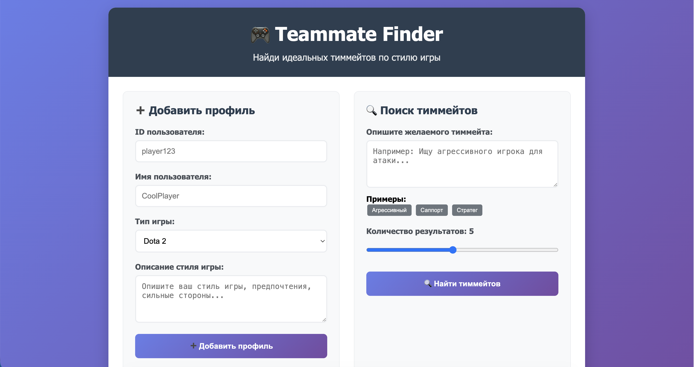
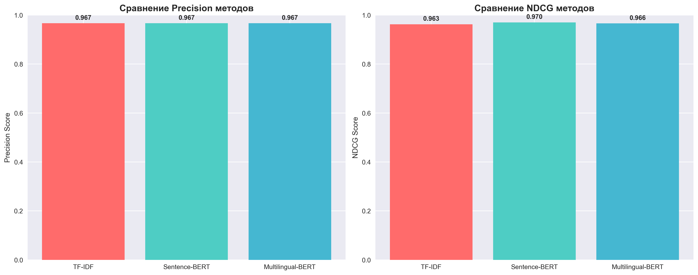
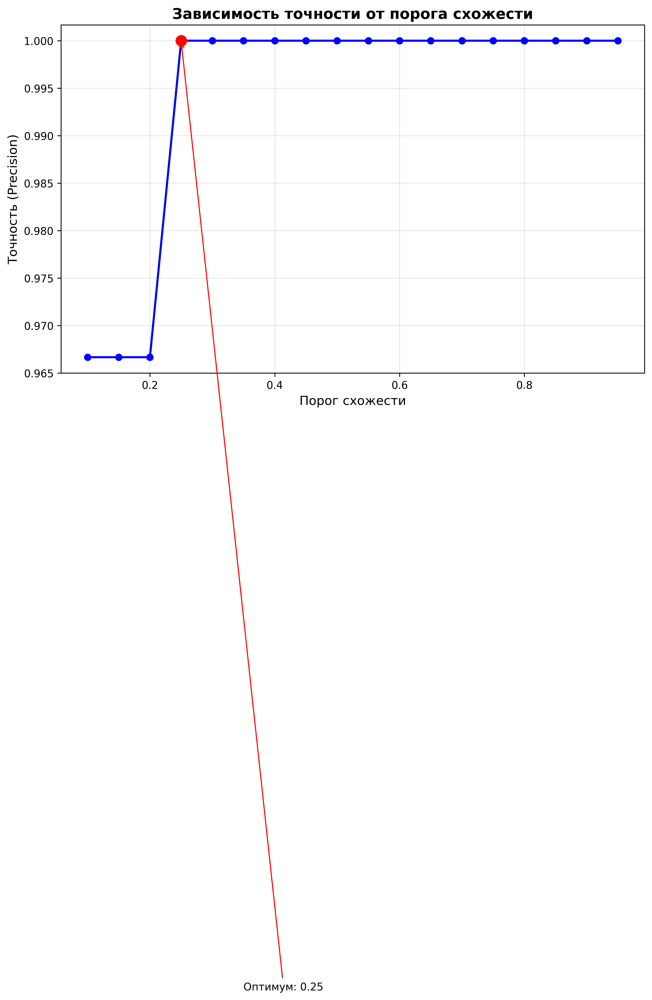
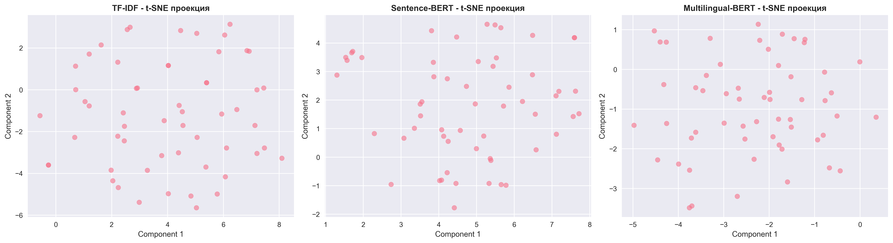

**Teammate Finder — Система поиска тиммейтов по описанию стиля игры**

Разработка веб-приложения для автоматического подбора напарников по играм на основе анализа текстовых описаний стиля игры пользователей. Система использует методы обработки естественного языка (NLP) и машинного обучения для поиска семантически похожих игроков.

**Цель проекта:**\
Создать автоматизированную систему, которая по свободному текстовому описанию находит пользователей с похожим стилем игры.

**Задачи:**\
- Реализовать обработку текста на русском языке (очистка, лемматизация, замена сленга)\
- Разработать механизм преобразования текста в векторные представления (эмбеддинги)\
- Создать базу данных для хранения профилей пользователей и их эмбеддингов\
- Реализовать поиск похожих пользователей на основе косинусной близости векторов\
- Разработать веб-интерфейс для взаимодействия с системой\
- Создать REST API для интеграции с внешними сервисами

**Функциональные требования**\
1. Регистрация и управление профилем\
- Добавление нового пользователя с указанием:\
- Уникального ID\
- Имени пользователя\
- Текстового описания стиля игры\
- Типа игры (Dota 2, CS:GO, Valorant, LoL, другое)\
- Удаление пользователя из системы\
- Просмотр информации о пользователе по ID

2. Поиск тиммейтов\
- Поиск по текстовому описанию желаемого тиммейта\
- Возврат топ-K наиболее подходящих кандидатов\
- Отображение процента схожести для каждого результата\
- Фильтрация по типу игры

3. Обработка текста\
- Приведение текста к нижнему регистру\
- Удаление специальных символов и эмодзи\
- Замена игрового сленга на нормализованные формы\
- Удаление стоп-слов\
- Лемматизация слов

4. Визуализация\
- Отображение статистики системы (количество пользователей, распределение по играм)\
- Карточки найденных пользователей с описанием и процентом совпадения

**Технические требования**\
Python 3.11\
FastAPI\
SQLite с векторным поиском\
Sentence Transformers, PyTorch, scikit-learn\
NLTK, pymorphy2\
HTML/CSS с адаптивным дизайном\
JavaScript для взаимодействия с API

**Выбор модели для обработки языка**

*Рисунок 1 - Сравнение метрик Precision и NDCG для различных методов*

### Анализ результатов:\
- **TF-IDF**: Precision = 0.967, NDCG = 0.963\
- **Sentence-BERT**: Precision = 0.967, NDCG = 0.970\
- **Multilingual-BERT**: Precision = 0.967, NDCG = 0.966\

Все три метода показывают высокую точность (0.967). Sentence-BERT показал наилучший результат по NDCG (0.970), что означает лучшее качество ранжирования результатов, но мультиязычные модели (Sentence-BERT, Multilingual-BERT) не уступают классическому TF-IDF

## Выбор порога для точных результатов

*Рисунок 2 - Изменение точности поиска в зависимости от порога схожести*

- **X-ось**: Порог схожести (от 0.1 до 1.0)\
- **Y-ось**: Точность (Precision)

При низких порогах (0.1-0.3) точность снижается из-за большого количества ложных срабатываний. Оптимальный диапазон: порог 0.6-0.8, так как при пороге выше 0.9 точность падает, так как система находит слишком мало результатов

## Визуализация векторных представлений

*Рисунок 3 - Визуализация эмбеддингов в 2D пространстве с помощью t-SNE*

- Точки на графике = отдельные текстовые описания игроков\
- Близко расположенные точки = семантически похожие описания\
- Разные цвета = различные игровые стили

**TF-IDF**: точки разбросаны достаточно равномерно\
**Sentence-BERT**: заметны четкие кластеры (хорошо разделяет разные стили)\
**Multilingual-BERT**: формирует плотные группы похожих текстов

в целом все неплохо справились, так как датасет состоит из небольшого колличества примеров, но все же Sentence-BERT лучше всего разделяет игроков именно по стилю игры
